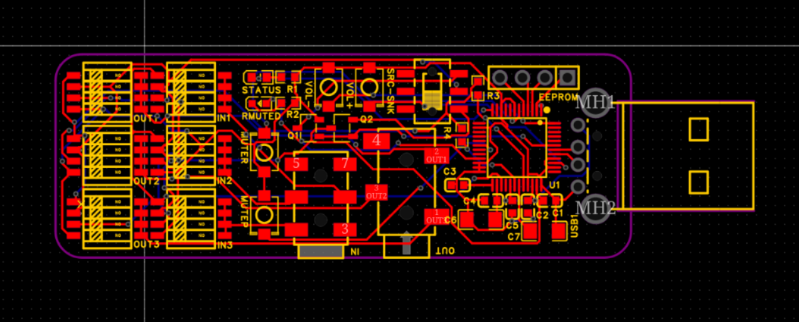
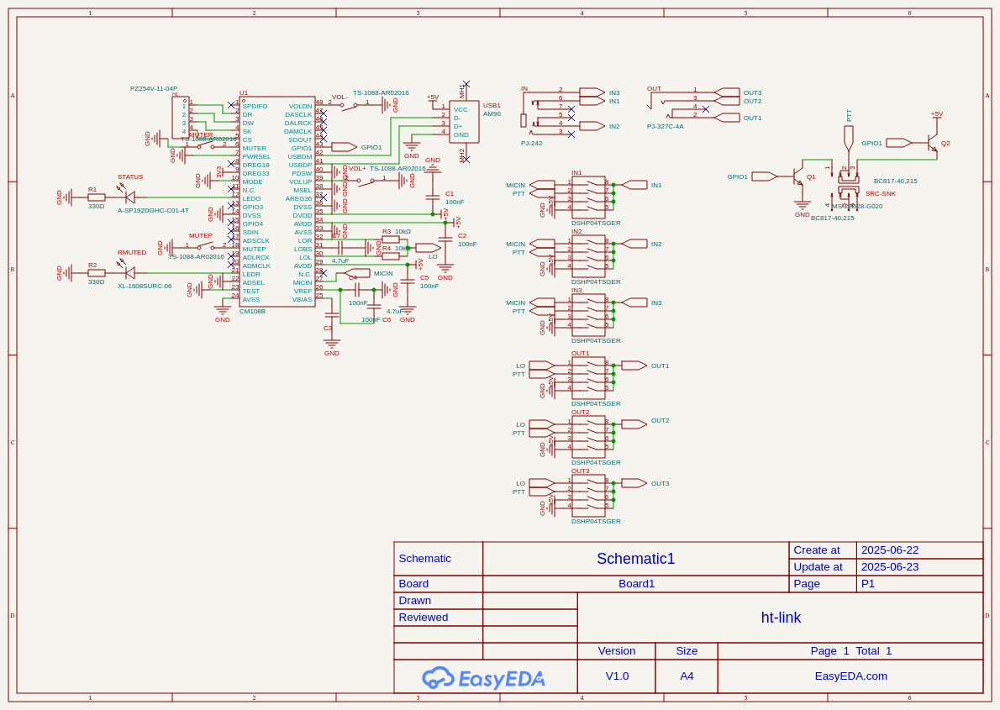
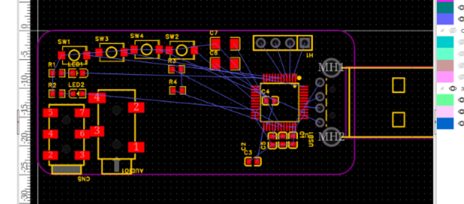
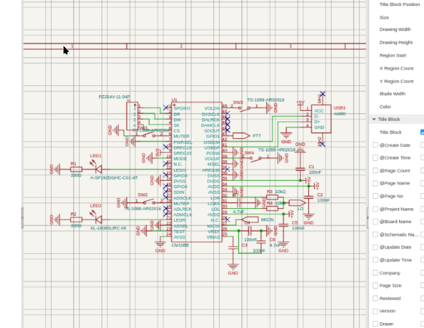
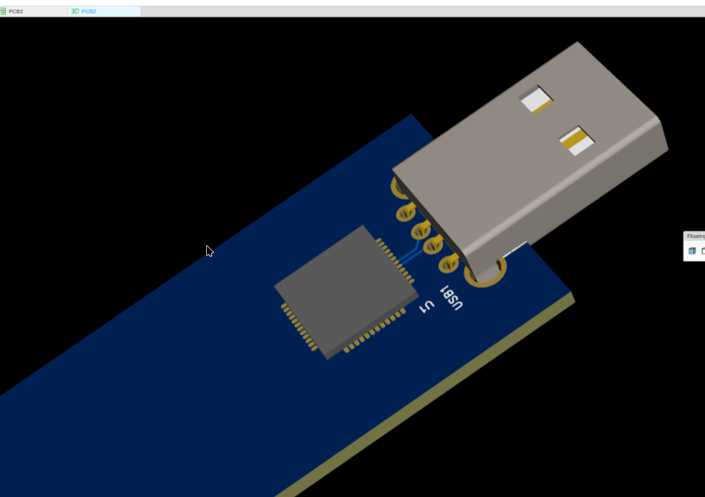

title: "ht-link"
author: "@TheTridentGuy"
description: "USB adapter to connect cheap handhelds to a computer"
### Total time: 14h 30m

### July 5:
2h

Update: I'm going to put this on hold until I can discuss PCB orderring with my reviewer.

And after going further down the ordering road i have determined that i am fucked, and so i am replacing all the non-basic parts with equivalent basic parts. I hate jlcpcb.

This project finally got approved, but I realized my USB connector is standard PCBA only, so I'm switching it to a economic compatible one. Since this took slightly more space for some reason, I had to move components, but everything except the exact model of USB connector is the same. The extended component fee was also exorbitant, so I chose not to place the LEDs and associated resistors.

### June 27:
30m

Touch up pcb, and get everything ready for submission

### June 24:
2h

struggled with JLCPCB's website, and submitted to the gallery, also made a few minor pcb updates.

### June 23 (Part 2):
4h

I thought I had finally quit circuit design (I hadn't):

### June 23:
6h

Did a ton of work on schematic and pcb, most of the time was spent reading the datasheet though.

### June 22:
2h

Did a lot of research and started on a basic pcb prototype. I expect to have to iterate this pcb a few times.

### June 21: 
30m

research, probably gonna use the Cmedia CM108B as the main chip for this board.
