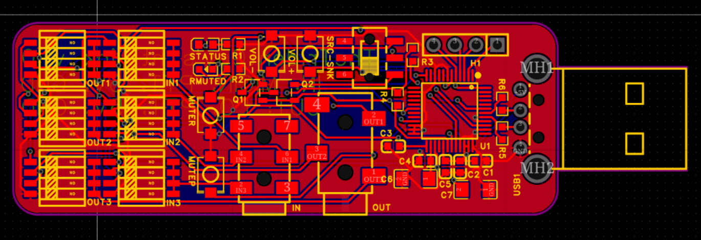

# ht-link
## Open-source usb adapter that allows you to link cheap handheld radios to a computer for internet-linked radio applications.
This USB adapter acts as an audio device and has a 2.5mm and a 3.5mm audio jack for connection to a handheld radio such as the UV-K6. I created this after going to the middle of nowhere for a week and realizing how many cool things could be made with a radio connected to a computer, for example a VOIP phone over ham radio, or a slack link. It's based on the Cmedia CM108B, and the current version includes six DIP switches for configuring exactly how audio is routed. It also makes use of one of the CM108B's GPIO pins for PTT, which can be source or sink, based on a switch setting. I'm not making a case for now, since this probably isn't the final form of the PCB, and I expect to iterate it at least one more time. I also prefer the simple bare-board aesthetic for this project.

#### DIP switches:
`IN1`, `IN2`, `IN3` Connect input jack to:
- `MICIN`
- `PTT`
- `5V`
- `GND`

`OUT1`, `OUT2`, `OUT3` Connect output jack to:
- `LO` (audio line out)
- `PTT`
- `5V`
- `GND`

### PCB:

### Schematic: 

### Bom:
