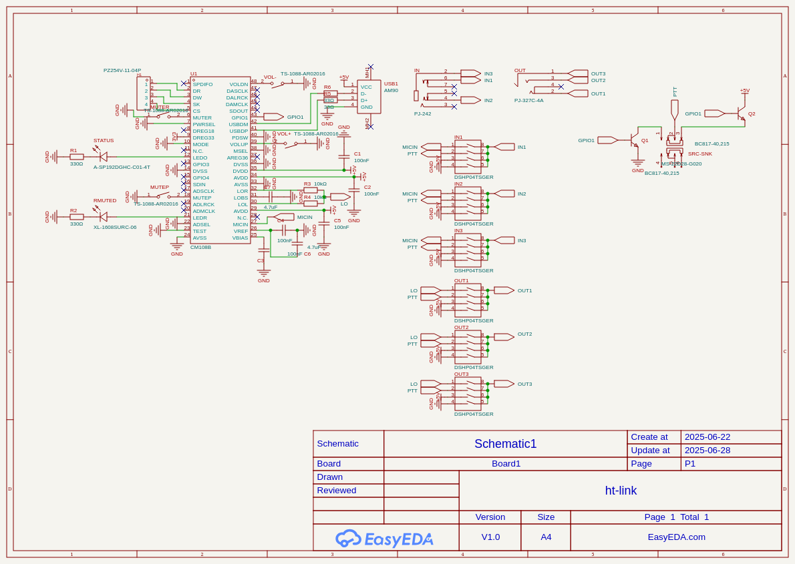

# ht-link
## Open-source usb adapter that allows you to link cheap handheld radios to a computer for internet-linked radio applications.
This USB adapter acts as an audio device and has a 2.5mm and a 3.5mm audio jack for connection to a handheld radio such as the UV-K6. The current version includes several switches for configuring how each pin of each jack is wired. I created this after going to the middle of nowhere for a week and realizing how many cool things could be made with a radio connected to a computer, for example a VOIP phone, or a slack link.
### PCB:

### Schematic: 

### Bom:
